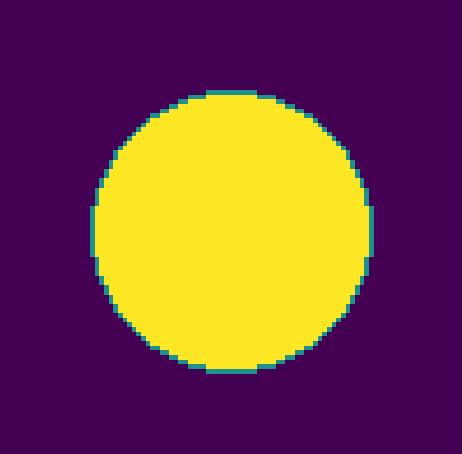
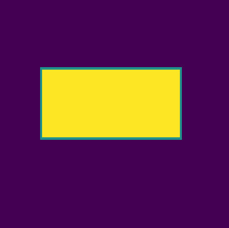
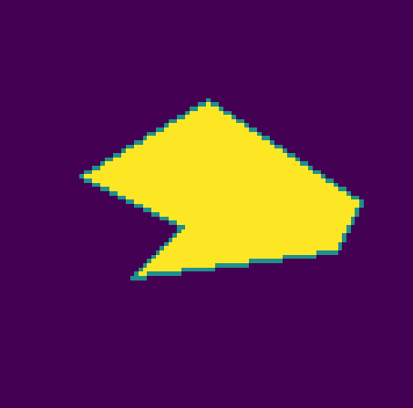
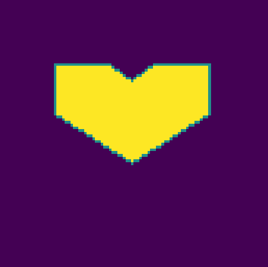

# Flood Fill 

Abaixo temos os resultados do preenchimento de formas geométricas realizadas pelo algoritmo Flood Fill. 

## Preenchimento de Circunferência

- Circunferência desenhada pelo algoritmo de rasterização de circunferências, Bresenham.

## Preenchimento de Retângulo 

- Retângulo desenhado utilizando o algoritmo de rasterização linear Bresenham.

#### 

## Preenchimento do Hexágono

- Hexágono desenhado utilizando o algoritmo de rasterização linear Bresenham.

## Preenchimento do Octágono

- Octágono desenhado utilizando o algoritmo de rasterização linear Bresenham.

