## Rasterização de Linhas com os Algoritmos Analítico, Analisador Diferencial Digital e Bresenham

Desenho de retas por meio dos algoritmos de raterização linear: Analítico, Analisador Diferencial Digital (DDA)  e Bresenham.

## Algoritmo Analítico

---

O **método analítico** utiliza uma abordagem simples e intuitiva para determinar a equação de uma reta a partir de dois pontos. O procedimento é descrito a seguir:

### Passos do Algoritmo:

O método usado pelo algoritmo analítico é o mais simples e intuitivo, que consiste em:

   - Dados os extremos P_1(x_1, y_1) \ e \ P_2(x_2, y_2)

- Descobre a equação reduzida da reta \( y = mx + b \):
  - O coeficiente angular \( m \)é dado por:

  $$
  m = \frac{y_2 - y_1}{x_2 - x_1}
  $$
  
  - O coeficiente linear \( b \) pode ser encontrado por:
  
  $$
  b = y_1 - m \cdot x_1
  $$

Portanto, a equação reduzida da reta será:

$$
y = m \cdot x + b
$$

---

  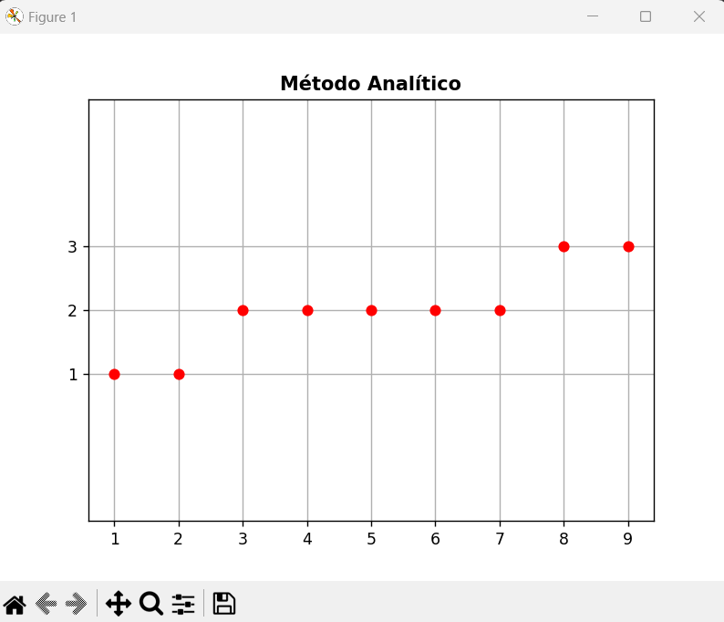

  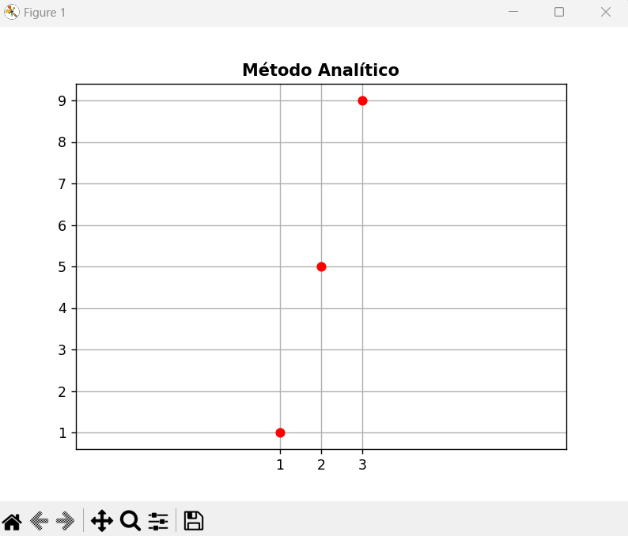

  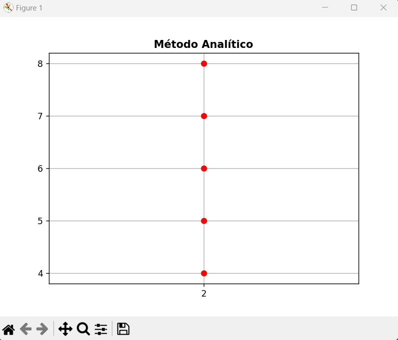

  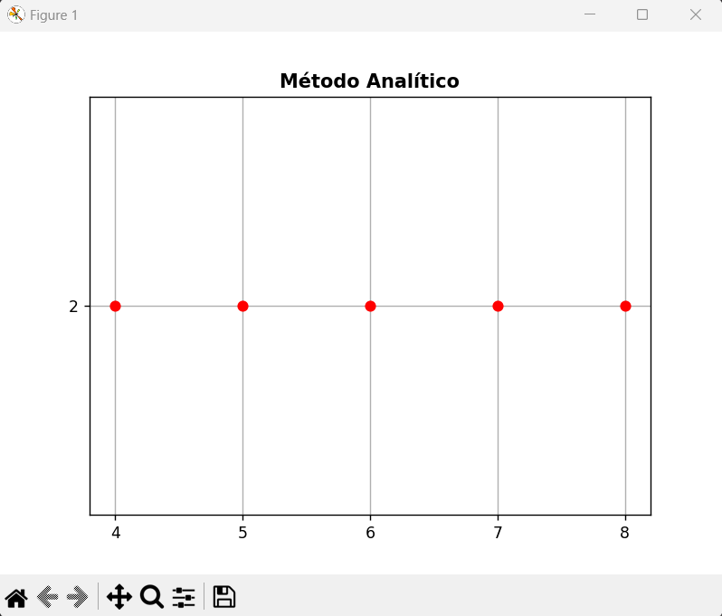

### Algoritmo Analisador Diferencial Digital (DDA)

  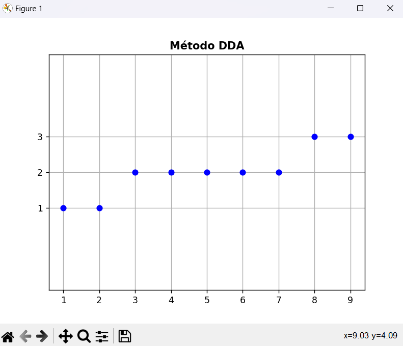

  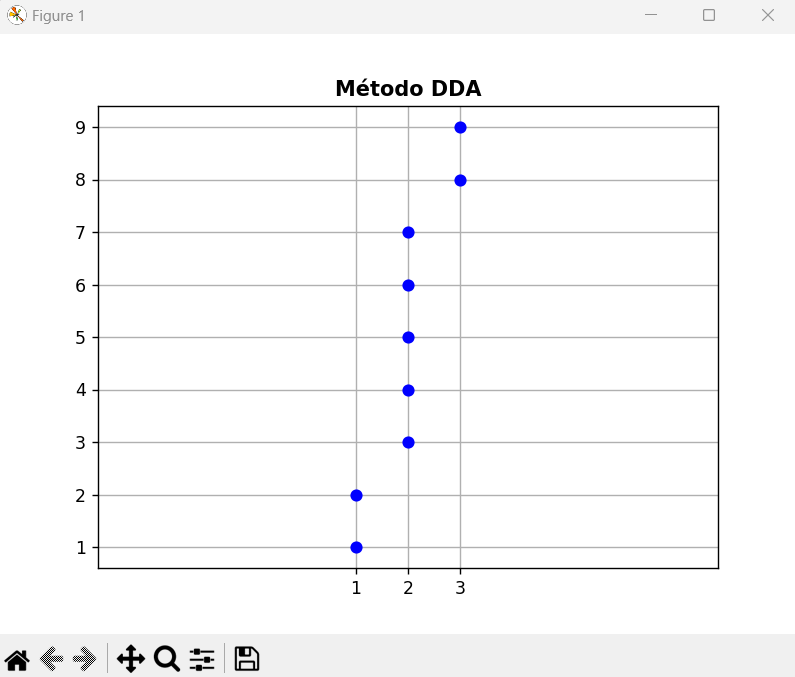

  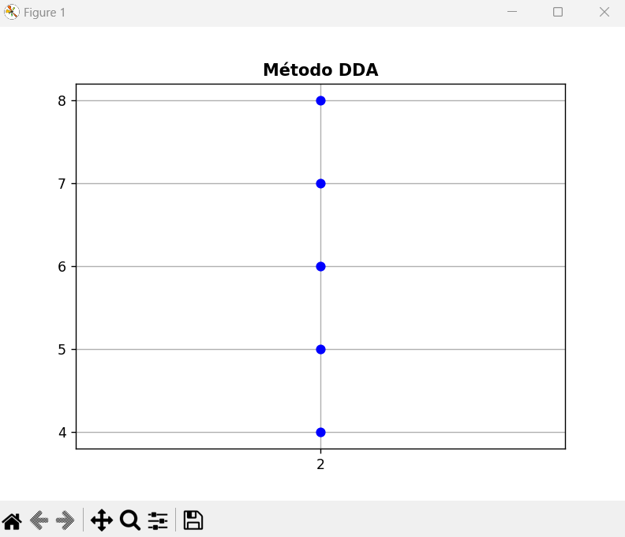

  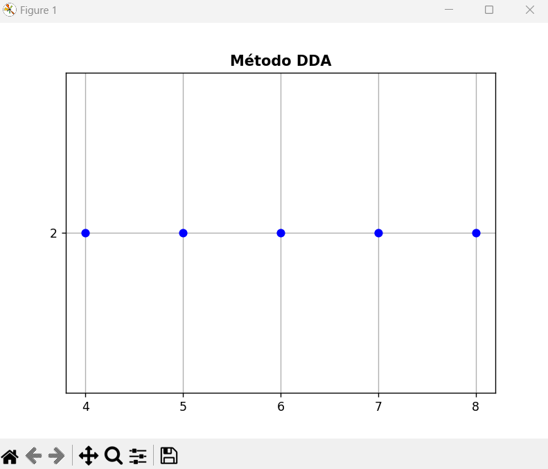
  

### Algoritmo Bresenham

  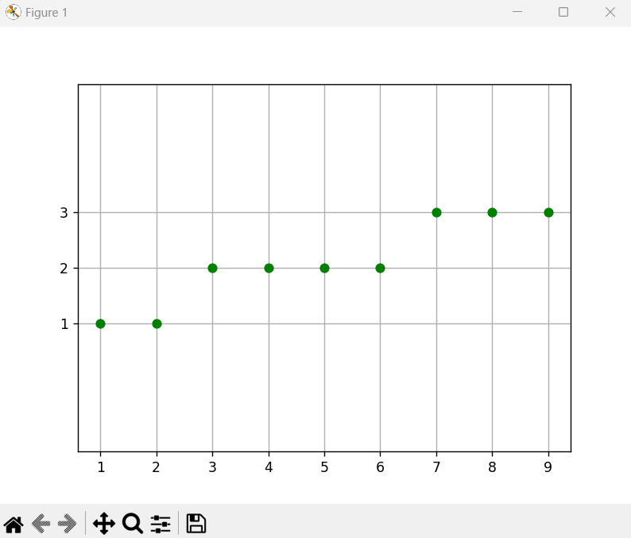

  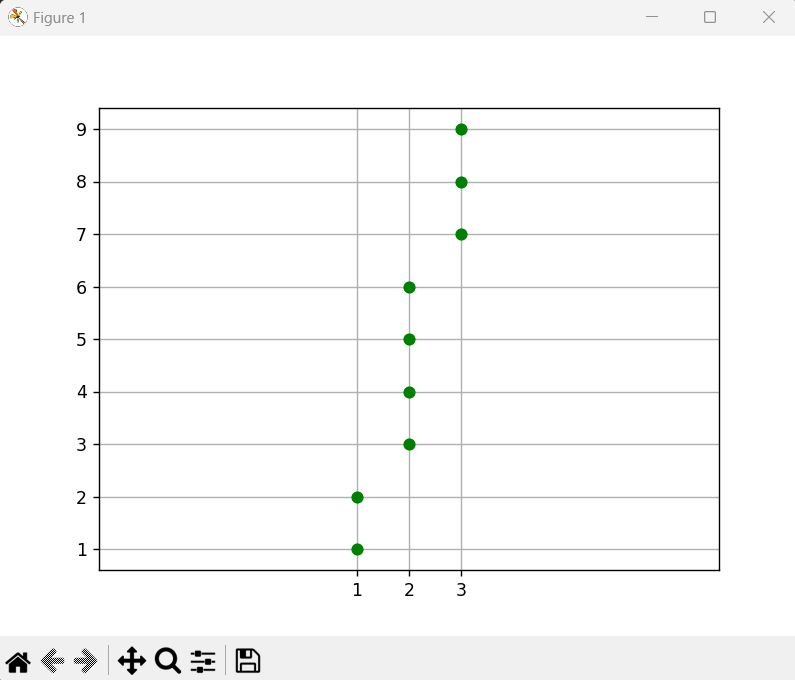

  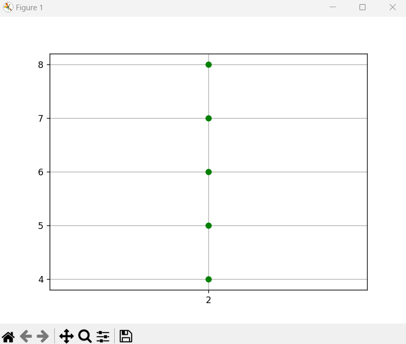

  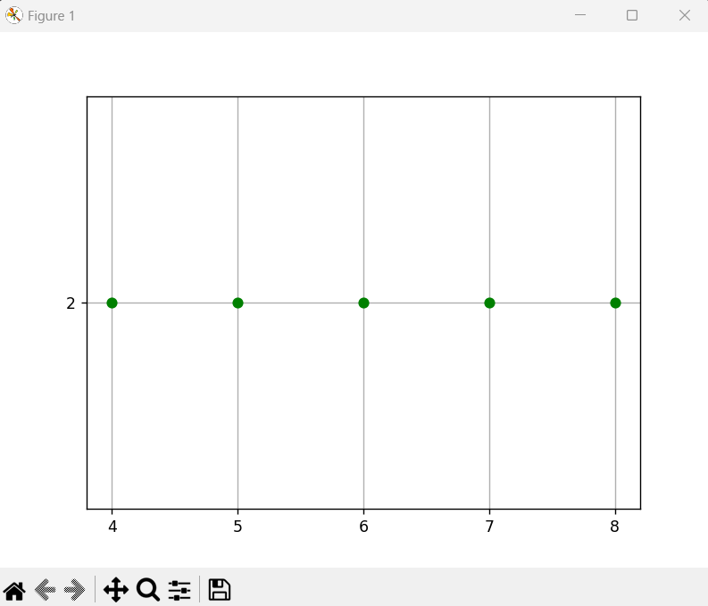
  

